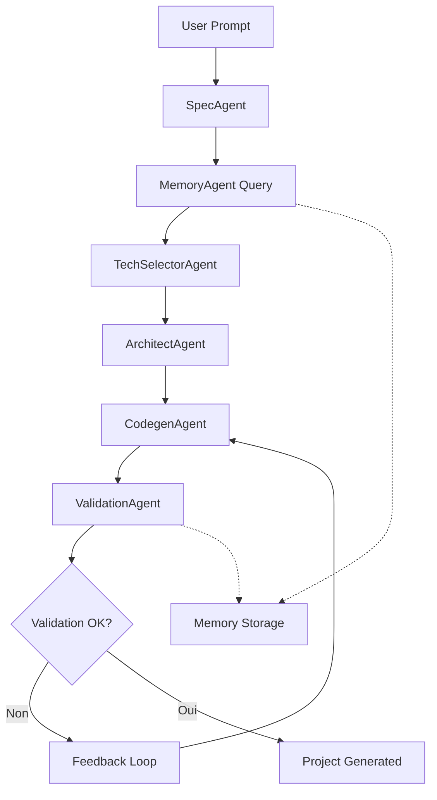

# 🤖 AgentForge - Full Agentic Branch

## 🎯 Vision

Cette branche développe un **pipeline agentique complet** qui fonctionne en **parallèle** avec le système existant, permettant à l'utilisateur de choisir entre deux modes via l'UI :

### 📊 Comparaison des Modes

| Feature | Light Agentic (master) | Full Agentic (cette branche) |
|---------|----------------------|---------------------------|
| **LLM Usage** | Spec extraction uniquement | Agents LLM pour chaque étape |
| **Intelligence** | Heuristiques + LLM ponctuel | Agents spécialisés communicants |
| **Mémoire** | Aucune | Système de mémoire persistant |
| **Validation** | Tests basiques | Agent QA intelligent |
| **Architecture** | Pipeline linéaire | Graph d'agents conditionnels |
| **Vitesse** | ⚡ Rapide | 🤖 Plus lent mais plus intelligent |
| **Coût** | 💰 Économique | 💳 Plus coûteux (plus d'appels LLM) |

## 🏗️ Architecture Full Agentic

### 🧠 Agents Spécialisés

1. **🎯 SpecAgent**
   - Analyse sémantique avancée du prompt
   - Génération de specs détaillées avec relations
   - Détection d'patterns architecturaux

2. **⚙️ TechSelectorAgent** 
   - Analyse contextuelle avec smolagents
   - Recommandations basées sur l'historique
   - Justifications argumentées des choix

3. **🏗️ ArchitectAgent**
   - Design patterns et structure modulaire
   - Architecture microservices vs monolithe
   - Optimisations performances/sécurité

4. **💻 CodegenAgent**
   - Génération de code contextuelle
   - Patterns avancés (DDD, Clean Architecture)
   - Code reviews automatiques

5. **🧠 MemoryAgent**
   - Apprentissage des préférences utilisateur
   - Historique des décisions techniques
   - Suggestions basées sur les projets passés

6. **✅ ValidationAgent**
   - Tests approfondis multi-niveaux
   - Analyse de sécurité automatisée
   - Recommandations d'amélioration

7. **🔄 OrchestratorAgent**
   - Coordination des agents
   - Gestion des échecs et retry
   - Optimisation du workflow

### 🔄 Workflow Intelligent



### 🎮 Interface Utilisateur

#### Mode Selection
- **🔘 Light Agentic** : Pipeline rapide et économique (mode actuel)
- **🔘 Full Agentic** : Intelligence maximale avec agents spécialisés
- **🔘 Hybrid** : Combinaison intelligente selon la complexité

#### Dashboard Agentique
- 📊 Monitoring des agents en temps réel
- 🧠 Visualisation de la mémoire système
- 📈 Métriques de performance et coût
- 🔄 Historique des décisions

## 🚀 Plan de Développement

### Phase 1 : Architecture Parallèle
- [ ] Création du pipeline agentique séparé
- [ ] Interface de sélection de mode
- [ ] Tests A/B entre les deux modes

### Phase 2 : Agents Spécialisés
- [ ] MemoryAgent avec SQLite
- [ ] TechSelectorAgent avec smolagents
- [ ] ValidationAgent avec analyses multi-niveaux

### Phase 3 : Intelligence Avancée
- [ ] Communication inter-agents
- [ ] Apprentissage et adaptation
- [ ] Optimisations de workflow

### Phase 4 : Interface Utilisateur
- [ ] Dashboard web pour monitoring
- [ ] Configuration avancée des agents
- [ ] Visualisations et rapports

## 🔧 Configuration

### Variables d'Environnement Supplémentaires

```env
# Mode Selection
AGENTFORGE_MODE=light|full|hybrid

# Full Agentic Settings
AGENTFORGE_MEMORY_ENABLED=1
AGENTFORGE_ADVANCED_VALIDATION=1
AGENTFORGE_INTER_AGENT_COMMUNICATION=1

# Agent Configuration
AGENT_MAX_RETRIES=3
AGENT_TIMEOUT_SECONDS=120
AGENT_MEMORY_TTL_DAYS=30
```

### Nouvelles Dépendances

```txt
# Agents Framework
smolagents>=1.21.2
langgraph>=0.2.24
langchain-community>=0.2.6

# Memory & Persistence  
sqlite-utils>=3.35.0
chromadb>=0.4.0

# Advanced Analytics
numpy>=1.24.0
scikit-learn>=1.3.0
```

## 📊 Métriques de Comparaison

### Critères d'Évaluation

1. **⚡ Performance**
   - Temps de génération
   - Consommation mémoire
   - Appels LLM

2. **🎯 Qualité**
   - Précision des specs
   - Qualité du code généré
   - Pertinence des choix tech

3. **🧠 Intelligence**
   - Adaptation au contexte
   - Apprentissage utilisateur
   - Gestion des cas complexes

4. **💰 Coût**
   - Tokens LLM consommés
   - Temps de développeur
   - Infrastructure requise

## 🎯 Objectifs de Réussite

### Court terme (1-2 semaines)
- ✅ Architecture parallèle fonctionnelle
- ✅ Interface de sélection de mode
- ✅ Premier agent spécialisé (MemoryAgent)

### Moyen terme (1 mois)
- 🎯 Tous les agents spécialisés opérationnels
- 🎯 Communication inter-agents
- 🎯 Dashboard de monitoring

### Long terme (2-3 mois)
- 🚀 Système d'apprentissage automatique
- 🚀 Optimisations intelligentes de workflow
- 🚀 Interface utilisateur complète

## 🤝 Tests et Validation

### Protocole de Test A/B

1. **Mêmes prompts** sur les deux modes
2. **Métriques comparatives** automatisées
3. **Feedback utilisateur** sur la qualité
4. **Analyse des coûts** LLM

### Cas de Test

- ✅ Projets simples (CRUD basique)
- ✅ Projets moyens (API avec auth)
- ✅ Projets complexes (Architecture microservices)
- ✅ Cas particuliers (Contraintes spécifiques)

---

## 🎮 Getting Started

```bash
# Activer le mode Full Agentic
export AGENTFORGE_MODE=full

# Tester avec un prompt simple
python -m orchestrator.graph --prompt "E-commerce platform" --mode full

# Comparer avec le mode light
python -m orchestrator.graph --prompt "E-commerce platform" --mode light --compare
```

**🎯 L'objectif : Prouver que l'intelligence agentique peut créer des projets significativement meilleurs, même si c'est plus lent et coûteux.**
